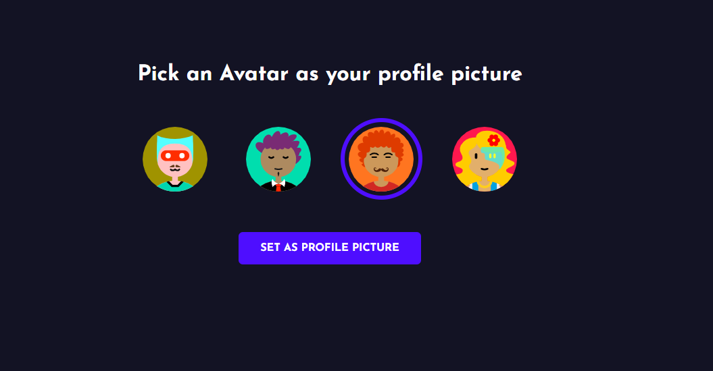

# Chat-Sat - Chat Application 
Chat-sat is chat application build with the power of MERN Stack. Users can chat with your contacts anywhere in the world.


# Unlimited Chat Experience :
 In this chat application user register them self and their credentials will saved on Database and the password saved in bcrypt format and also the conversation between one user to another user will saved on database so that user can see the last conversations.   

Project Info :
client :
  | Tech      | Selection / Commands         |
  | --------- | ---------------------------- |
  | Client    |  React                       |
  | UI Setup  | `npx create-react-app client`|
  | Framework | React                        |
  | Varient   | JavaScript                   |


Dependencies used :
 | Dependency        | Version | Command                   |
 | ----------------- | ------- | ------------------------- |
 |axios	             | ^0.25.0 |	`npm i axios `         |
 |styled-components	 | ^5.3.3  |  `npm i styled-components`|
 |react-icons	     | ^4.3.1  | `npm i react-icons`       |
 |socket.io-client   | ^4.4.1  | `npm i socket.io-client`  |
 |socket.io:         | ^4.4.1  | `npm i socket.io `        |
 |react-router-dom	 | ^6.2.1  | `npm i react-router-dom ` |

  **Folder Structure :**
- `Chat-Sat`- Root Directory
 - `client` - Root UI Directory
      - `node_modules` - Contains all dependency files used in client
      - `public` - Contains all the public files for Chat-Sat-LOGO
        - `LOGO.png`
      - `src` - Contains all the source files for client
        - `assets` - Contains assests for client
          - `loader.gif`
          - `logo.svg`
          - `robot.gif`
       - `components` - Contains all the components used in client
          - `ChatContainer.jsx`
          - `ChatInput.jsx`
          - `Contacts.jsx`
          - `Logout.jsx`
          - `SetAvatar.jsx`
          - `Welcome.jsx`
        - `pages` - Contains all the pages for client
          - `Chat.jsx`
          - `Login.jsx`
          - `Register.jsx`
        - `pages`  - contains all the styled files
          - `styleChat.js`
          - `styleLogin.js`
          - `styleRegister.js`
        - `utils`
          - `APIRoutes.js`
        - `App.js ` 
        - `index.css`
        - `index.js`
        - `.gitignore`
        - `package-lock.json`
        - `package.json`

   - ### server :

  | Tech       | Selection / Commands     |
  | ---------- | ------------------------ |
  | server     | Node + Express + MongoDB |
  | Setup      | `npm init -y`            |  

  **Dependencies used :**
  |Dependency| Version| Command|
  |----------|--------|--------|
  |cors | ^^2.8.5 | `npm i cors`|
  |dotenv | ^16.0.0 | `npm i dotenv`|
  |express | ^4.17.2 | `npm i express`|
  |mongoose | ^6.2.1 | `npm i mongoose`|
  |nodemon | ^2.0.15 | `npm i nodemon`|  
  |socket.io | ^4.4.1 | `npm i socket.io` | 

  **Folder Structure :**
   - `Chat-Sat`- Root Directory

    - `node_modules` - Contains all dependency files used in server
      - `controllers`
        - `messageController.js`
        - `userController.js`
      - `models`
        - `messageModel.js`
        - `userModel.js`
      - `routes`
        - `auth.js`
        - `message.js`
      - `index.js`
      - `package-lock.json`
      - `package.json`
      - `.gitignore`

## Project Setup

 - Clone entire project repo.
 - Open the cloned project with VS code.
 
 - **Setting up client:**
 - Go to app directory : `cd client`.
 - Now create .env file for enviroment variable.
 - Install all the dependencies for client
    ```
    npm install
    ```
  - Run app
    ```
    npm start

- **Setting up client:**   
- Go to app directory : `cd server`.
  - Install all the dependencies for server
  - Now create .env file for enviroment variable.
    ```
    npm install
    ```
  - Run server
    ```
    node index.js

# Project Snapshots :
  
  ## Signup :
  

  ## Set_Profile_Picture :
  

  ## Login :
  

  ## Chat-Sat Chat main window :
  


**All Rights Reserved - Kumar Saurabh**


